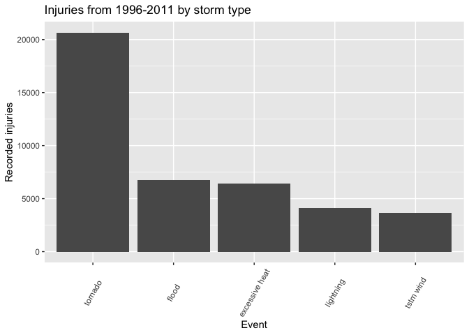
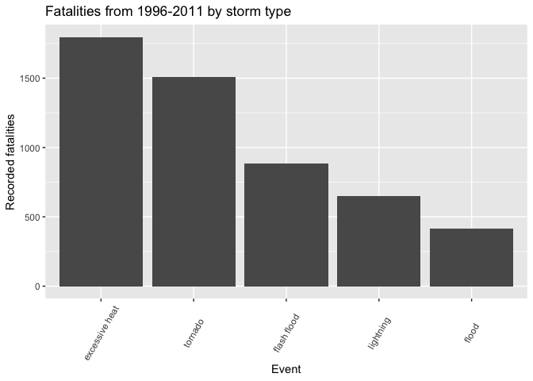
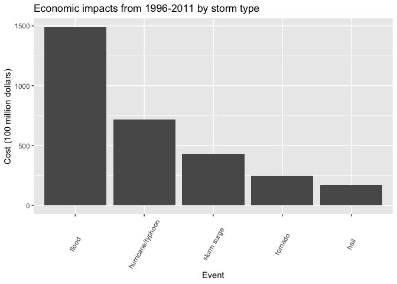

# The Most Destructive Storm Types from 1996-2011 

## Synopsis  
The National Weather Service and the National Oceanic and Atmospheric Administration has been tracking storm types and the human impacts of these storms since 1950, with extensive coverage dating from 1996-2011. While storms produce negative effects, both economic and health-wise, the distribution of destruction does not occur evenly between storm types. Similar storms produce the greatest mortal risks in tornados, floods, heat, and lightning, but in differing orders when you discern between fatalities and injuries.Tornados and floods also contribute to economic destruction by storms, but hail, hurricanes, and storm surges also warrent consideration when discussing what storms cost us the most.  

## Data Processing
I obtained [data](http://d396qusza40orc.cloudfront.net/repdata%2Fdata%2FStormData.csv.bz2) kept by NOAA on storms starting in 1950 and ending in 2011.   
First, I read the compressed storm data file on storms from 1950 to 2011 into the workspace. I read in strings as character values to allow for reproducability, and add in NA values for values not included in the dataset, indicated by blank or "" entries.  

```r
down <- download.file("http://d396qusza40orc.cloudfront.net/repdata%2Fdata%2FStormData.csv.bz2", destfile = "./data.csv.bz2")

data <- read.csv("./data.csv.bz2", stringsAsFactors = FALSE, na.strings = "")
```
After loading the data, I examine its structure in its dimensions.

```r
dim(data)
```

```
## [1] 902297     37
```

Investigating the data by sorting by date, I realize that the data does not contain an even distribution of measurements through time. The data looks much more complete after 1996, comparing complete data to complete data offers a more complete relative picture, so I will use only data from 1996-2011(data processing further on).

```r
library(dplyr)
```

```r
data$BGN_DATE <- as.Date(data$BGN_DATE, "%m/%d/%Y %H:%M:%S")
##obtain counts of measurements per year
databyyear <- data %>% mutate(year = format(BGN_DATE, "%Y")) %>% group_by(year) %>% summarize(total = length(year))

databyyear[41:51,]
```

```
## # A tibble: 11 x 2
##    year  total
##    <chr> <int>
##  1 1990  10946
##  2 1991  12522
##  3 1992  13534
##  4 1993  12607
##  5 1994  20631
##  6 1995  27970
##  7 1996  32270
##  8 1997  28680
##  9 1998  38128
## 10 1999  31289
## 11 2000  34471
```
  
The mean number of measurements pre-1996 is

```r
mean(databyyear$total[1:46])
```

```
## [1] 5407.978
```
  
  
The mean number of measurements 1996 and onward is

```r
mean(databyyear$total[47:62])
```

```
## [1] 40845.62
```
  
In order to assess the economic and population health challenges presented by storms, I looked at fatalities/injuries for population health outcomes and at property/crop damage for direct economic effects. I sorted both for measurements from 1996 onward and for variables pertaining to fatalities/injury and economic expenses alongside some identifying variables.

```r
fildata <- data %>% mutate(year = format(BGN_DATE, "%Y")) %>% filter(year >= "1996") %>% select("STATE__", "BGN_DATE", "BGN_TIME", "TIME_ZONE", "COUNTY", "COUNTYNAME", "STATE", "EVTYPE", "FATALITIES", "INJURIES", "PROPDMG", "PROPDMGEXP", "CROPDMG", "CROPDMGEXP", "REMARKS", "year")
```
  
Fatality and injury data seems fairly complete, as neither has any missing values:

```r
injury.NA <- sum(is.na(fildata$INJURIES))
fatality.NA <- sum(is.na(fildata$FATALITIES))
cbind(injury.NA, fatality.NA)
```

```
##      injury.NA fatality.NA
## [1,]         0           0
```
  
The dataset for the costs of different types of storms seems mixed, with the number sets being complete, but their "exponent" column being less complete with 42% of the property values missing and 57% of the crop values missing.

```r
property.NA <- sum(is.na(fildata$PROPDMG))
crop.NA <- sum(is.na(fildata$CROPDMG))
property.exp.NA.percentage <- mean(is.na(fildata$PROPDMGEXP))
crop.exp.NA.percentage <- mean(is.na(fildata$CROPDMGEXP))
cbind(property.NA, property.exp.NA.percentage, crop.NA, crop.exp.NA.percentage)
```

```
##      property.NA property.exp.NA.percentage crop.NA crop.exp.NA.percentage
## [1,]           0                  0.4226049       0              0.5708521
```
  
For examining threats to population health, I want data on injuries/fatalities based on the type of event grouped by year.  First, I convert all the event types to lower case letters so they would fall into the same categorization despite capitalization upon data entry.  I then calculate the total amount of fatalities and injuries due to different event types.  I then order this data to obtain a general ranking and convert it to a data frame to make graphing easier.  Since I want to look at the most effective storm types, I will examine the top five contributors to storm destruction throughout.  

```r
##get the ordered total amount of fatalities by event type
fildata$EVTYPE <- tolower(fildata$EVTYPE)
fatalrank <- fildata %>% group_by(EVTYPE) %>% summarise(total = sum(FATALITIES)) %>% arrange(desc(total))
##get the top five most fatal events in a data frame
resultfatal <- fatalrank[1:5,]
resultfatal <- as.data.frame(resultfatal)
##get the ordered total amount of injuries by event type
injuryrank <- fildata %>% group_by(EVTYPE) %>% summarise(total = sum(INJURIES)) %>% arrange(desc(total))
##get the five events that caused the most injuries as a data frame
resultinjury <- injuryrank[1:5,]
resultinjury <- as.data.frame(resultinjury)
```

For examining the largest economic threats, I look at the sum of crop and property damage.  As the data was stored as a number with a multiplier (NA, 0, K, M, B) in a secondary column, I convert the NA values in the multipliers to  0, which translates to a multiplier of 1, as calculations do not work with NA values. I convert the multipliers to numbers and then create new columns with the full numeric total in them.  I then perform a similar ordering of the data based on the cumulative total of these two columns and divided by 100 million to scale the data. 

```r
##convert NA multipliers to 0
fildata$PROPDMGEXP[is.na(fildata$PROPDMGEXP)] <- 0
fildata$CROPDMGEXP[is.na(fildata$CROPDMGEXP)] <- 0
##converting the data to an ordered factor
exporder <- c("0", "K", "M", "B")
fildata$PROPDMGEXP <- as.factor(fildata$PROPDMGEXP)
fildata$PROPDMGEXP <- ordered(fildata$PROPDMGEXP, levels = exporder)
fildata$CROPDMGEXP <- as.factor(fildata$CROPDMGEXP)
fildata$CROPDMGEXP <- ordered(fildata$CROPDMGEXP, levels = exporder)

##creating a new column with numeric values based on the multiplier values
expnum <- c(1, 1000, 1000000, 1000000000)
fildata$propexpnum <- expnum[fildata$PROPDMGEXP]
fildata$cropexpnum <- expnum[fildata$CROPDMGEXP]
##creating another column with the absolute values of the cost
fildata$propcost <- fildata$PROPDMG * fildata$propexpnum
fildata$cropcost <- fildata$CROPDMG * fildata$cropexpnum
fildata$totalcost <- fildata$cropcost + fildata$propcost
##order the data based on the type of event
costrank <- fildata %>% group_by(EVTYPE) %>% summarise(total = sum(totalcost)) %>% mutate(adjtotal = total / 100000000) %>% arrange(desc(total))
##get the top five most costly events in a data frame
resultcost <- costrank[1:5,]
resultcost <- as.data.frame(resultcost)
```
## Results
### Health Impacts
Injury data is stored in the resultinjury object, which needs conversion to a factor variable to be graphable and then further processing to maintain the data's order.  

```r
library(ggplot2)
resultinjury$EVTYPE <- as.factor(resultinjury$EVTYPE)
resultinjury$EVTYPE <- factor(resultinjury$EVTYPE, levels = resultinjury$EVTYPE[order(desc(resultinjury$total))])
```

```r
i <- ggplot(resultinjury, aes(EVTYPE, total))
i + geom_bar(stat = "identity") + theme(axis.text.x = element_text(angle = 60, vjust = 0.5)) + labs(title = "Injuries from 1996-2011 by storm type", x = "Event", y = "Recorded injuries")
```

<!-- -->
  
<br>From the above plot, we can see that tornadoes far and away produce the most injuries out of the given storm types. The next two contributers have similar injury incidence and the last two also show similar values.  
The same processing of the fatality data occurs as in the injury data.

```r
resultfatal$EVTYPE <- as.factor(resultfatal$EVTYPE)
resultfatal$EVTYPE <- factor(resultfatal$EVTYPE, levels = resultfatal$EVTYPE[order(desc(resultfatal$total))])
```

```r
f <- ggplot(resultfatal, aes(EVTYPE, total))
f + geom_bar(stat = "identity") + theme(axis.text.x = element_text(angle = 60, vjust = 0.5)) + labs(title = "Fatalities from 1996-2011 by storm type", x = "Event", y = "Recorded fatalities")
```

<!-- -->
<br>In the fatality data we see a similar group of storm types, but in a different order. Tornadoes still present a clear danger, as they injure the most people and kill the second most people.  Flooding events, including flash floods, kill many people.  Lightning both kills and injures many people.  

### Economic Threats
Let's compare the event types that produce health risks to the ones that cost the most economically.  

```r
resultcost$EVTYPE <- tolower(resultcost$EVTYPE)
resultcost$EVTYPE <- as.factor(resultcost$EVTYPE)
resultcost$EVTYPE <- factor(resultcost$EVTYPE, levels = resultcost$EVTYPE[order(desc(resultcost$total))])
```

```r
c <- ggplot(resultcost, aes(EVTYPE, adjtotal))
c + geom_bar(stat = "identity") + theme(axis.text.x = element_text(angle = 60, vjust = 0.5)) + labs(title = "Economic impacts from 1996-2011 by storm type", x = "Event", y = "Cost (100 million dollars)")
```

<!-- -->
<br>The top storm types that contribute to economic destruction show both similarities and difference with that of the top storm types that threaten people's health.  Floods and tornados were similarly in the top five for both injury and fatality producers.  Hurricanes, storm surge, and hail represent novel considerations when thinking about what storm types present the greatest risk for people.  
